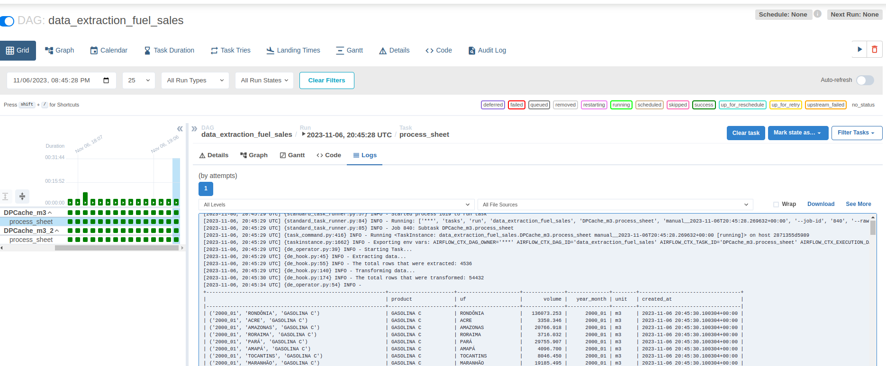

# Raízen ANP Challenge
---

The purpose of this DAG is to obtain the data from the ANP Fuel Sales.XLS file, transform it, and send it to an AWS S3 bucket.

### Sources:

* #### ANP Fuels Sales ETL test
    https://github.com/raizen-analytics/data-engineering-test/blob/master/TEST.md

* #### Excel File
    https://github.com/raizen-analytics/data-engineering-test/raw/master/assets/vendas-combustiveis-m3.xls

## Variables

A variable must be set up as "data_extraction_config". Follow a sample.

``` jsonc
{
    "url": "<.XLS url or .XLS local file path>",
    "sheets": "<[Sheet names that will be processed]>",
    "bucket": "<AWS S3 bucket destination>"
}

```

## Destination

The processed data will be sent to an AWS S3 bucket as in the previous config.

Follow the S3 bucket example.
    https://data-extraction-fuel-sales.s3.amazonaws.com/processed_files/2023-11-06/dpcache_m3_2_db7c8b6a-2eb5-40ee-af59-ef087d923af6_20231106204531.parquet

    https://data-extraction-fuel-sales.s3.amazonaws.com/processed_files/2023-11-06/dpcache_m3_5aba5e31-9007-4edd-bfe2-b4136a47ae92_20231106204534.parquet    

## Execution



## Layers UML Diagram

```mermaid
classDiagram
    DataExtractionFuelSalesOperator <|-- DAG : data_extraction_fuel_sales
    DataExtractionFuelSalesHook <|-- DataExtractionFuelSalesOperator

    class DAG{ 
        + Variables
    } 
    
    class DataExtractionFuelSalesOperator{
        + Variables
        + execute()
    }

    class DataExtractionFuelSalesHook{
        + extract_sheet()
        + translate_columns()
        + translate_col_months()
        + transform_data()
        + validate_schema()
        + upload_to_s3()
    }
 ```