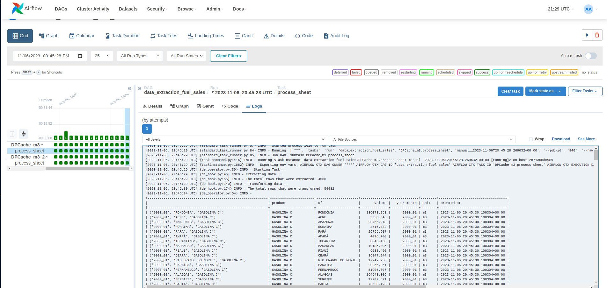
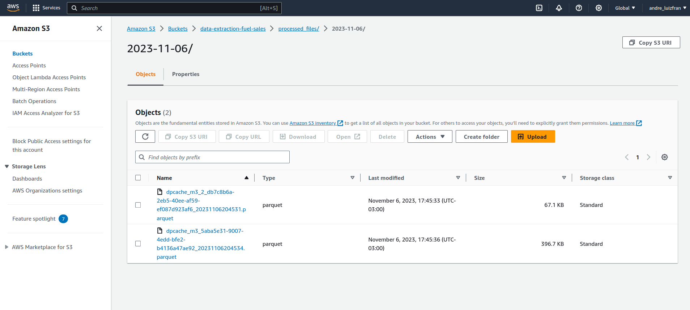

## ANP Challenge
The purpose of this DAG is to extract the data from the ANP Fuel Sales.XLS file, transform it, and send it to an AWS S3 bucket.

### Sources
---

* #### Excel File
    https://github.com/raizen-analytics/data-engineering-test/raw/master/assets/vendas-combustiveis-m3.xls


### Variables
---

A variable must be set up as "data_extraction_config". Follow the example.

``` json
{
    "url": "<.XLS url or .XLS local file path>",
    "sheets": "<[Sheet names that will be processed]>",
    "bucket": "<AWS S3 bucket destination>"
}

```

### Executions
---




### Destination
---

As shown in the previous configuration, the processed data will be sent to an AWS S3 bucket.

* Files on S3 bucket.

    * [dpcache_m3_2](https://data-extraction-fuel-sales.s3.amazonaws.com/processed_files/2023-11-06/dpcache_m3_2_db7c8b6a-2eb5-40ee-af59-ef087d923af6_20231106204531.parquet)

    * [dpcache_m3](https://data-extraction-fuel-sales.s3.amazonaws.com/processed_files/2023-11-06/dpcache_m3_5aba5e31-9007-4edd-bfe2-b4136a47ae92_20231106204534.parquet)




### UML Diagram
---

```mermaid
classDiagram
    DataExtractionFuelSalesOperator <|-- DAG : data_extraction_fuel_sales
    DataExtractionFuelSalesHook <|-- DataExtractionFuelSalesOperator

    class DAG{ 
        + Variables
    } 
    
    class DataExtractionFuelSalesOperator{
        + Variables
        + execute()
    }

    class DataExtractionFuelSalesHook{
        + extract_sheet()
        + transform_data()
        + validate_schema()
        + upload_to_s3()
    }
 ```